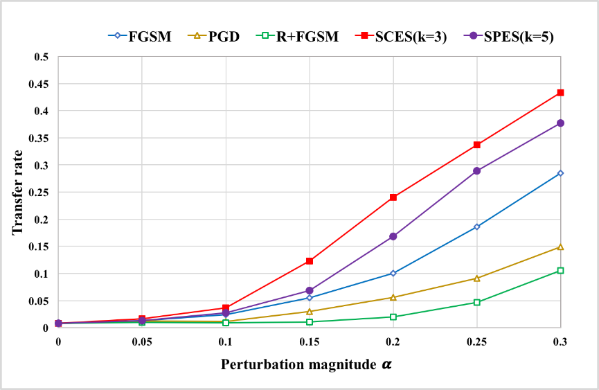

# Ensemble Adversarial Black-Box Attacks against Deep Learning Systems
Deep learning (DL) models, e.g., state-of-the-art convolutional neural networks (CNNs), have been widely applied into security sensitivity tasks, such as face payment, security monitoring, automated driving, etc. Then their vulnerability analysis is an emergent topic, especially for black-box attacks, where adversaries do not know the model internal architectures or training parameters. In this paper, two types of ensemble based black-box attack strategies, selective cascade ensemble strategy (SCES) and stack parallel ensemble strategy (SPES), are proposed to explore the vulnerability of DL system and potential factors that contribute to the high-efficiency attacks are explored, SCES adopts a boosting structure of ensemble learning and SPES employs a bagging structure. Moreover, two pairwise and non-pairwise diversity measures are adopted to examine the relationship between the diversity in substitutes ensembles.

In our paper, due to limited space , some experimental results are not presented, we show the entire experimental results as follows:
The transferability of adversarial examples generated by each substitute model and cascading or paralleling any k substitutes (e.g. k=3,5) are illustrated in Fig. 1. 

(a) USPS
001
(b) MNIST
008
(c) GTSRB
Fig. 1. Transfer rate of adversarial examples crafted by SCES and SPES under different perturbation magnitude α on (a)USPS, (b)MNIST and (c)GTSRB.
Fig. 10, 11, 12. demonstrates that our proposed ensemble-based black-box attack strategies are still aggressive to target classifier trained with adversarial training and ensemble adversarial training defense mechanism.
016
(a) Black-box model trained with adversarial training
017
(b) Black-box model trained with ensemble adversarial training
Fig. 10. Defense performance of black-box model trained with (a)adversarial training and (b)ensemble adversarial training against different attacks on USPS.  
002
(a) Black-box model trained with adversarial training
005
(b) Black-box model trained with ensemble adversarial training
Fig. 12. Defense performance of black-box model trained with adversarial training and ensemble adversarial training against different attacks on MNIST.  
009
(a) Black-box model trained with adversarial training

012
(b) Black-box model trained with ensemble adversarial training
Fig. 12. Defense performance of black-box model trained with (a)adversarial training and (b)ensemble adversarial training against different attacks on GTSRB. 
Transfer rate of adversarial examples crafted by SCES and SPES with k=1, 3 and 5 under different perturbation magnitude α in FGSM are shown in Fig. 13., Fig. 14. and Fig. 15.
003
(a) SCES
014
(b) SPES
Fig. 13. Transfer rate of adversarial examples crafted by (a)SCES and (b)SPES with k=1, 3 and 5 under different perturbation magnitude α on USPS.  
015
   (a) SCES
004
(b) SPES
Fig. 14. Transfer rate of adversarial examples crafted by (a)SCES and (b)SPES with k=1, 3 and 5 under different perturbation magnitude α on MNIST.  
010
(a) SCES     
011
(b) SPES
Fig. 15. Transfer rate of adversarial examples crafted by (a)SCES and (b)SPES with k=1, 3 and 5 under different perturbation magnitude α on GTSRB. 

                                                        (b) GTSRB
                                                        
Fig. 1. Transfer rate of adversarial examples crafted by SCES and SPES under different perturbation magnitude α on (a)USPS and (b)GTSRB.
 
                                     (a) Black-box model trained with adversarial training
 
                                    (b) Black-box model trained with ensemble adversarial training
                                    
Fig. 2. Defense performance of black-box model trained with (a)adversarial training and (b)ensemble adversarial training, against different attacks on MNIST.  
 
                                     (a) Black-box model trained with adversarial training
 
                                    (b) Black-box model trained with ensemble adversarial training
                                    
Fig. 3. Defense performance of black-box model trained with (a)adversarial training and (b)ensemble adversarial training, against different attacks on GTSRB. 
 
                                                          (a) SCES
 
                                                          (b) SPES
                                                          
Fig. 4. Transfer rate of adversarial examples crafted by (a)SCES and (b)SPES with k=1, 3 and 5 under different perturbation magnitude α on USPS.  
 
                                                          (a) SCES
 
                                                          (b) SPES
                                                          
Fig. 5. Transfer rate of adversarial examples crafted by (a)SCES and (b)SPES with k=1, 3 and 5 under different perturbation magnitude α on MNIST.  

# Delving into Diversity in Substitute Ensembles and Transferability of Adversarial Examples
Our part work has been appeared in "Delving into Diversity in Substitute Ensembles and Transferability of Adversarial Examples", which can be downloaded by: https://link.springer.com/chapter/10.1007/978-3-030-04182-3_16
